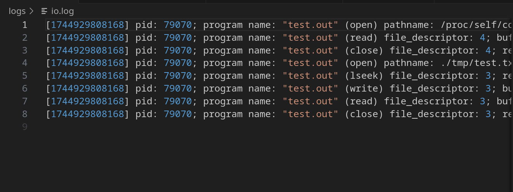
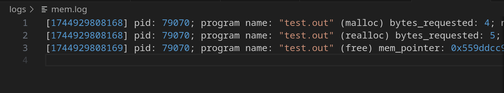

# Логирование без спроса
Логирование функций из libc

[Документация](./docs/common.md)

### Требования

libc: 2.36-9\
gcc: 12.2.0

### Запуск

1) Склонировать проект
```
git clone https://github.com/under-tension/logging_without_asking.git

cd logging_without_asking
```

2) Собрать проект
```
make
```

3) Запустить демонов для логирования в файлы логов
```
sudo ./bin/logd.out 2 $(pwd)/logs/io.log $(pwd)/logs/mem.log
```

4) Запустить тестовый пример программы
```
sudo LD_PRELOAD=./bin/liblogger.so ./bin/test.out
```

После этого в файлах logs/io.log и logs/mem.log должны появится логи

log/io.log


log/mem.log"


Уничтожить демонов

```
sudo kill 15 $(cat /var/run/io_logd.pid)
```

```
sudo kill 15 $(cat /var/run/mem_logd.pid)
```